# Vera Pipeline Failure Taxonomy & Root Cause Attribution

**Version**: `VERA_FAILURE_TAXONOMY v2.0`  
**Purpose**: Rigorous classification of any quality, safety, grounding, or state failure across the 12 failure classes ($A$ through $L$).

---

## 1. The Twelve Failure Classes

```mermaid
graph TD
    subgraph INGRESS_FAILURES ["Ingress & Data Availability"]
        A["Class A: Upstream Missing Data<br/>(Raw Magicpin payload lacks required field)"]
        B["Class B: Fact Extraction Failure<br/>(Failed to parse or recurse into payload)"]
        C["Class C: Fact-Role Inference Failure<br/>(Misclassified role, e.g. Cohort vs Specificity)"]
    end

    subgraph SELECTION_FAILURES ["Selection & Budgeting"]
        D["Class D: Relevance Scoring Failure<br/>(Scored below threshold or wrong dimension)"]
        E["Class E: Context-Budget Failure<br/>(Important fact displaced by lower-priority item)"]
    end

    subgraph REASONING_FAILURES ["LLM & Intent Processing"]
        F["Class F: LLM Reasoning Failure<br/>(Hallucinated number, ignored cited facts)"]
        G["Class G: Validator Rejection Failure<br/>(False positive rejection of valid suggestion)"]
        H["Class H: Intent Classification Failure<br/>(Misclassified opt-out, question, or affirm)"]
    end

    subgraph EXECUTION_FAILURES ["State, Output & External"]
        I["Class I: State-Machine Failure<br/>(Invalid transition, revived terminal thread)"]
        J["Class J: Output Composition Failure<br/>(Taboo leak, ungrounded grammar/formatting)"]
        K["Class K: External Provider Failure<br/>(LLM API 5xx, timeout budget exhaustion)"]
        L["Class L: Evaluation Harness Mismatch<br/>(Test assert asserted ungrounded benchmark text)"]
    end

    A --> B --> C --> D --> E --> F --> G --> H --> I --> J --> K --> L
```

---

## 2. Failure Class Definitions & Diagnostic Signatures

| Class ID | Failure Class Name | Definition & Boundary | Diagnostic Signature / Trace Evidence | Resolution Strategy |
| :---: | :--- | :--- | :--- | :--- |
| **A** | **Upstream Missing Data** | Raw context ingested via `/v1/context` does not contain the requested field. Vera correctly refuses to fabricate data. | `fact_id` absent in candidate fact set; raw JSON lacks key. | Refusal / Clarification (Never hallucinate). |
| **B** | **Fact Extraction Failure** | Ingestion pipeline fails to parse nested dictionary, list, or scalar into a dot-notated `Fact`. | Raw JSON has field, but `candidate_facts` list is missing path. | Fix recursive parser in `FactExtractor`. |
| **C** | **Fact-Role Inference Failure** | Extracted fact assigned incorrect `FactRole` (e.g. `customer_aggregate` mislabeled as generic `SPECIFICITY`). | `Fact.role` mismatch; wrong slot allocation in budget. | Refine structural role heuristics in `facts.py`. |
| **D** | **Relevance Scoring Failure** | Relevant fact scored $<3.0$ or noise fact scored $\ge 3.0$ due to uncalibrated feature weights. | `feat.total_score` $<3.0$ for vital fact, or $>3.0$ for noise metric. | Adjust dimensional weights ($T_f, E_f, C_f, D_f, P_f$). |
| **E** | **Context-Budget Failure** | High-scoring fact pushed out because total facts exceeded budget cap (Budget Inversion). | Fact scored $>3.0$ but omitted with `omitted_budget_limit_exceeded`. | Enforce Role-Aware Slot Allocation. |
| **F** | **LLM Reasoning Failure** | LLM generates claims, numbers, or dates not present in `supported_facts`. | `LLMDecisionSuggestion.draft_body` contains ungrounded entity/number. | Blocked by 11-point validator $\rightarrow$ Fallback. |
| **G** | **Validator False Rejection** | 11-point validator incorrectly flags a valid, safe, and fully grounded suggestion. | `val_result.is_valid == False` with false error reason. | Refine lexical lookarounds in `validator.py`. |
| **H** | **Intent Classification Failure** | Deterministic pre-gate misclassifies inbound user reply (e.g. opt-out treated as question). | `classify_intent` returns wrong `ReplyIntent`. | Add strict word-boundary regexes. |
| **I** | **State-Machine Failure** | Outbound action sent on concluded thread, or invalid transition between conversation turns. | Action emitted when `conv.current_state` is terminal. | Enforce terminal double lock in `interaction.py`. |
| **J** | **Output Composition Failure** | Deterministic fallback composition leaks taboo term or generates malformed sentence structure. | Outbound body contains taboo word or grammar clash. | Refine `_scrub_taboos` and template formatting. |
| **K** | **External Provider Failure** | Upstream model provider returns HTTP 429/500 or exceeds $1500\text{ms}$ client timeout. | `LLMBoundaryTrace.fallback_triggered == True`. | Seamless deterministic fallback via CircuitBreaker. |
| **L** | **Evaluation Harness Mismatch** | Test harness expects benchmark-specific wording or asserts behavior on an uninitialized turn. | Pytest fails on rigid substring assertion despite valid output. | Generalize test assertion to semantic contract. |
