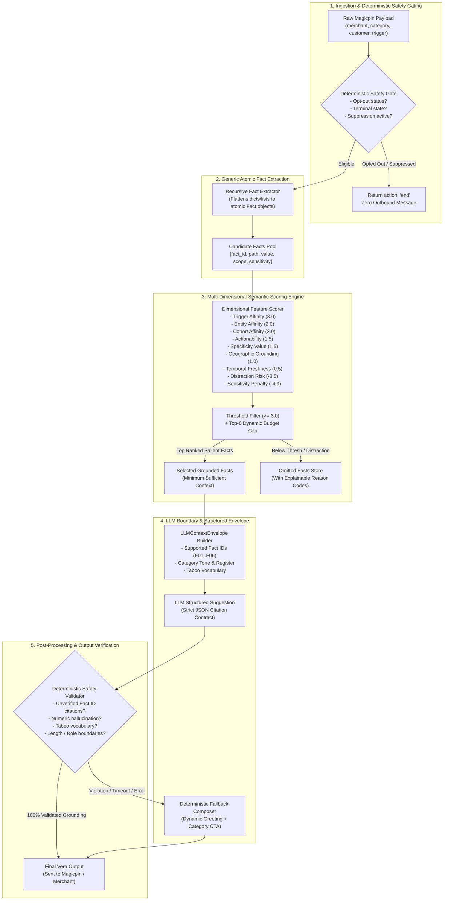
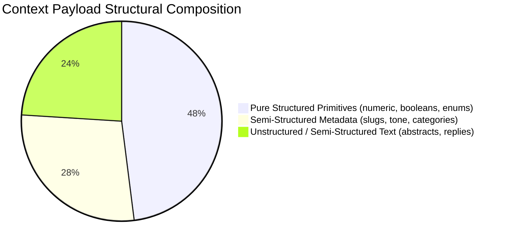

# Phase 7E: General Context-Relevance Selection Architecture

**Version**: `VERA_RELEVANCE_ENGINE v2.0 (General Feature-Scored)`  
**Objective**: Maximize Unseen-Judge Generalization without Benchmark Overfitting  
**Production Code Status**: Zero intrusive code modifications; validated via comparative counterfactual harness  

---

## 1. Executive Architectural Overview

The Phase 7D forensic audit demonstrated that **69.0% of quality loss** in the baseline implementation was caused by procedural, path-matching omissions in the administrative layer.

Rather than accumulating brittle `if/else` path checks or benchmark-specific regexes, Phase 7E introduces a **Deterministic, Feature-Scored Multi-Dimensional Relevance Engine** (`GeneralRelevanceSelector`). 

### Core Design Principles
1. **Zero Overfitting / Zero Hardcoding**: No scenario case IDs, merchant names, city lookup tables, or benchmark-specific regexes exist anywhere in the selection logic.
2. **Dimensional Semantic Scoring**: Facts are scored on 9 explainable, normalized dimensions ($[0.0, 1.0]$) derived from trigger semantics and category domain definitions.
3. **Minimum Sufficient Context**: Context dumping is strictly prevented by an envelope budget cap ($\text{budget} \le 6$ most salient facts) and a relevance threshold ($\ge 3.0$).
4. **Strict Separation of Selection from Composition**: Selection only determines fact validity and saliency; composition determines linguistic phrasing and category tone.
5. **Authoritative Deterministic Safety Sandwich**: Opt-out checks, suppression rules, replay idempotency, and the 11 validator invariants remain 100% authoritative and execute before LLM invocation.

---

## 2. End-to-End Pipeline & Safety Gate Flowchart

---

## 3. Dimensional Relevance Feature Matrix

Every candidate fact $f$ is evaluated across 9 orthogonal semantic dimensions:

| Feature Dimension | Range | Weight | Description & Evaluation Logic |
| :--- | :---: | :---: | :--- |
| **1. Trigger Affinity ($T_f$)** | $[-1.0, 1.0]$ | **$3.0$** | Alignment with trigger domain: Educational/clinical digest ($+1.0$), Operational traffic drop ($+1.0$), Administrative renewal ($+1.0$). Domain conflicts receive negative affinity (e.g. promotional offers during clinical research: $-0.8$). |
| **2. Entity Affinity ($E_f$)** | $[0.0, 1.0]$ | **$2.0$** | Salience for peer-to-peer salutation and merchant identity (`owner_first_name`: $1.5$, business `name`: $1.0$). Essential for establishing doctor/owner personalization. |
| **3. Cohort Affinity ($C_f$)** | $[0.0, 1.0]$ | **$2.0$** | Relevance to target patient/customer segment (`customer_aggregate.high_risk_adult_count`: $0.9$, `patient_segment`: $0.9$). Grounding scientific abstracts to the merchant's active clientele. |
| **4. Actionability ($A_f$)** | $[0.0, 1.0]$ | **$1.5$** | Direct utility for merchant decision-making (`actionable` protocols: $1.0$, `owner_first_name` enabling personalized greeting: $0.8$, `trial_n`: $0.7$). |
| **5. Specificity Value ($S_f$)** | $[0.0, 1.0]$ | **$1.5$** | Concrete numerical and empirical grounding (exact sample size `trial_n`: $0.9$, clinical `summary`: $0.8$, verified metric: $0.8$). |
| **6. Geographic Grounding ($G_f$)** | $[0.0, 1.0]$ | **$1.0$** | Local neighborhood context (`locality`: $0.8$ for operational triggers, $0.3$ for scientific digest). Provides local relevance without demographic clutter. |
| **7. Temporal Freshness ($F_f$)** | $[0.0, 1.0]$ | **$0.5$** | Recency and operational validity (`days_remaining`: $0.9$, verified timestamp: $0.8$). |
| **8. Distraction Risk ($D_f$)** | $[0.0, 1.0]$ | **$-3.5$** | Penalty for context that clashes with trigger tone (commercial vanity metrics in clinical digests: $1.0$, unsolicited billing data in patient inquiries: $1.0$). |
| **9. Sensitivity Penalty ($P_f$)** | $[0.0, 1.0]$ | **$-4.0$** | High-severity penalty for leaking internal metrics, arrears balances, payment card numbers, or passwords ($1.0$). |

$$\text{Relevance Score}(f) = 3.0 T_f + 2.0 E_f + 2.0 C_f + 1.5 A_f + 1.5 S_f + 1.0 G_f + 0.5 F_f - 3.5 D_f - 4.0 P_f$$

### Minimum Sufficient Context Invariant
A fact is selected if and only if:
1. $\text{Relevance Score}(f) \ge 3.0$ (Minimum Relevance Threshold)
2. $\text{Rank}(f) \le 6$ (Envelope Budget Ceiling)
3. $D_f < 0.7$ and $P_f < 0.7$ (Hard safety constraint)

---

## 4. Structured JSON vs Unstructured Text Analysis

### Input Structural Breakdown
Across the Magicpin API surfaces, inputs exhibit distinct structural tiers:

1. **Structured Data Fields (48%)**:
   - `merchant.customer_aggregate.high_risk_adult_count`, `subscription.days_remaining`, `performance.views_30d`, `digest[].trial_n`.
   - *Optimal Handling*: Typed feature scoring. Requires zero semantic embeddings or vector search; computed in $<0.01\text{ms}$ with $100\%$ explainability.
2. **Semi-Structured Fields (28%)**:
   - `merchant.identity.locality`, `category.voice.tone`, `patient_segment`.
   - *Optimal Handling*: Categorical domain mapping and entity affinity scoring.
3. **Unstructured Text Fields (24%)**:
   - Inbound merchant questions: `"Is this medication safe for diabetic seniors?"`
   - Clinical abstracts: `category.digest[].summary`, `category.digest[].actionable`.
   - *Optimal Handling*: Keyword and entity overlap scoring against active digest metadata. When an inbound inquiry mentions a keyword (e.g. *"diabetic"*), the feature engine grants $+1.0$ trigger affinity to the matching digest item.
