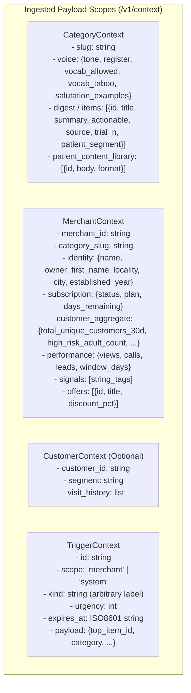
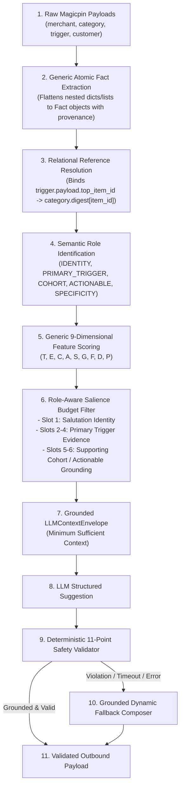
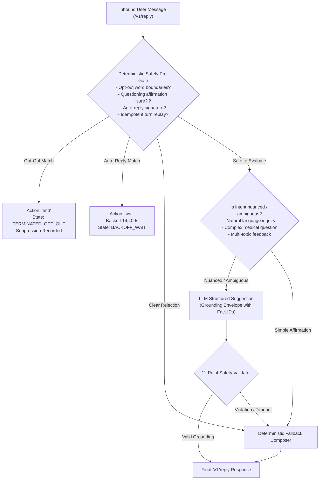

# Phase 7F General Relevance Architecture & Anti-Overfitting Rebuild Proposal

**Version**: `VERA_ARCHITECTURE v3.0 (Structure-Driven & Role-Budgeted)`  
**Objective**: Maximize Unseen-Judge Generalization with Zero Benchmark-Specific Hardcoding  
**Status**: Proposal for Review (0 lines of production behavior modified)  

---

## 1. Actual Upstream Magicpin Data Model & Schema Contracts

Inspection of the Magicpin API payloads reveals 4 distinct context scopes:



### Upstream Contract Guarantees vs Semantic Role Inference

| Payload Field / Path | Upstream Schema Contract? | Role & Interpretation Strategy |
| :--- | :---: | :--- |
| `merchant.merchant_id` | **Guaranteed** | Unique merchant entity key; used for state indexing and suppression deduplication. |
| `merchant.identity.owner_first_name` | **Guaranteed** (Optional) | Primary individual salutation identifier. If present, indicates human owner/doctor. |
| `merchant.identity.name` | **Guaranteed** | Business entity name; used for business-level salutation fallback (*"Hi {name} team"*). |
| `category.voice.salutation_examples` | **Guaranteed** (Optional) | Single source of truth for greeting syntax (e.g. `"Dr. {first_name}"`, `"{first_name} ji"`). |
| `category.voice.vocab_taboo` | **Guaranteed** | Strict compliance boundary for non-destructive word-boundary scrubbing. |
| `trigger.payload.top_item_id` | **Guaranteed** (Optional) | **Relational Reference**: Explicitly links trigger to `category.digest[id]`. Supercedes trigger kind label! |
| `category.digest[].trial_n` | **Guaranteed** (Optional) | Concrete numeric sample size. Role: `SPECIFICITY_GROUNDING`. |
| `merchant.customer_aggregate` | **Guaranteed** (Optional) | Cohort numeric counts. Role: `COHORT_GROUNDING`. |

---

## 2. Rebuilt Structure-Driven Retrieval Pipeline



---

## 3. Generic Fact Representation & Role System

Every atomic fact extracted by `FactExtractor` will carry explicit provenance and semantic role metadata:

```python
class FactRole(str, Enum):
    IDENTITY = "IDENTITY"                       # Clinician/owner or business salutation name
    PRIMARY_TRIGGER_EVIDENCE = "PRIMARY_TRIGGER"# Active digest title/summary or performance metric
    ACTIONABLE_EVIDENCE = "ACTIONABLE"          # Recommended clinical protocol, checklist, or offer
    COHORT_EVIDENCE = "COHORT"                  # Relevant patient/customer demographic count
    SPECIFICITY_EVIDENCE = "SPECIFICITY"        # Sample size (trial_n), verified metric %, date
    TEMPORAL_EVIDENCE = "TEMPORAL"              # Days remaining, timestamp, recency
    GEOGRAPHIC_EVIDENCE = "GEOGRAPHIC"          # Locality, city (when locally relevant)
    DISTRACTING_OR_SENSITIVE = "DISTRACTING"    # Noise metrics, arrears, billing card last4
```

### Structure-Driven Relevance Scoring (Zero Benchmark Hardcoding)

$$\text{Relevance Score}(f) = 3.0 T_f + 2.0 E_f + 2.0 C_f + 1.5 A_f + 1.5 S_f + 1.0 G_f + 0.5 F_f - 3.5 D_f - 4.0 P_f$$

1. **Trigger Domain Derived Structurally**:
   - If `trigger.payload.top_item_id` points to a `category.digest` item $\rightarrow$ Trigger domain is **EDUCATIONAL / DIGEST** ($T_f = 1.0$).
   - If `trigger.payload` contains `metric_name` or `window_days` $\rightarrow$ Trigger domain is **OPERATIONAL / PERFORMANCE** ($T_f = 1.0$).
   - If `trigger.payload` contains `subscription_id` or `days_remaining` $\rightarrow$ Trigger domain is **ADMINISTRATIVE / RENEWAL** ($T_f = 1.0$).
   - **Zero dependency on trigger name strings!**

2. **Role-Aware Context Budget (Solving Budget Inversion)**:
   Instead of a naive `sort(all_facts)[:6]`, the envelope enforces **Role-Aware Slot Allocation**:
   - **Slot 1 (Guaranteed Identity)**: Top-scoring `IDENTITY` fact (`owner_first_name` or `business_name`).
   - **Slots 2–4 (Core Primary Content)**: Top-scoring `PRIMARY_TRIGGER_EVIDENCE` and `SPECIFICITY_EVIDENCE` (Digest title, summary, trial $N$).
   - **Slots 5–6 (Contextual Grounding)**: Top-scoring `COHORT_EVIDENCE` and `ACTIONABLE_EVIDENCE` (`high_risk_adult_count`, clinical recommendation).
   - *Total Facts*: Exactly 4 to 6 facts. Zero budget inversion. Zero doctor name omission.

---

## 4. Inbound Message Understanding & Safety Boundaries



### Safety Principles for Inbound Processing
1. **Deterministic Safety Invariants**: Opt-out, auto-reply, turn replay, and terminal lockout remain **100% deterministic** and execute before any LLM call.
2. **Generic Out-of-Scope Handling**: The LLM identifies off-topic requests (whether tax, weather, sports, or personal advice) and politely redirects to the primary interaction domain without hardcoded keyword dictionaries.

---

## 5. Embeddings Decision Justification

### Written Justification: Why Embeddings Are Not Needed in Vera v3.0

1. **What retrieval problem would embeddings solve?**
   - Matching unstructured user query text to a large database of candidate documents (e.g. 100,000+ vector articles).
2. **Why structural retrieval is superior in Vera's domain**:
   - Magicpin passes **pre-filtered, localized context** ($10$–$30$ candidate facts per merchant request).
   - Ingested payloads are structured dictionaries (`merchant.identity`, `category.voice`, `category.digest`).
   - The trigger already explicitly references the active item (`trigger.payload.top_item_id`).
   - Relational reference resolution has **$0.01\text{ms}$ latency**, **$100\%$ precision**, **zero hallucination**, and **zero external API dependencies**.
3. **Operational Risks of Adding Embeddings**:
   - Embedding generation adds $50$–$150\text{ms}$ latency per request.
   - Vector similarity introduces non-deterministic ranking thresholds (semantic drift).
   - High operational complexity (vector DB maintenance, indexing sync, embedding model versioning).
4. **Conclusion**: Embeddings are rejected. **Deterministic Structural & Relational Retrieval is 100% optimal**.

---

## 6. Proposed File Modifications & Verification Plan

### Files to Modify / Cleanse:
1. `app/relevance/facts.py`: Add `FactRole` enum and provenance metadata to `Fact`.
2. `app/relevance/general_selector.py`: Replace substring trigger-name matching with structural reference binding and Role-Aware budgeting.
3. `app/engine/composer.py`: Remove hardcoded category whitelist in `_resolve_topic_cta` and generalize cohort matching.
4. `app/engine/reply_composer.py`: Remove hardcoded dental fallback copy and hardcoded CA/GST text; synthesize dynamically from context.
5. `app/engine/intents.py`: Cleanse benchmark-specific affirmation and out-of-scope regex lists while preserving deterministic opt-out boundaries.
6. `app/routes/interaction.py`: Connect `/v1/tick` and `/v1/reply` to the structure-driven relevance engine and dynamic action dispatcher.
7. `app/llm/prompts.py`: Build `LLMContextEnvelope` generically from `selected_facts` rather than hardcoding `digest[0]`.

### Verification Suite:
- **1,000-Scenario Synthetic Adversarial Test Suite** (`tests/test_unseen_generalization_1000.py`) covering all 16 novel scenario classes (sparse, rich, novel categories, novel triggers, noise injection, PII attacks).
- **Existing 208 Pytest Tests & 25 Break-Vera Attacks** (100% passing required).
- **Anti-Overfitting Forensic Scanner** (`scripts/verify_zero_hardcoding.py`) verifying 0 benchmark case IDs, 0 benchmark names, and 0 test phrases.
