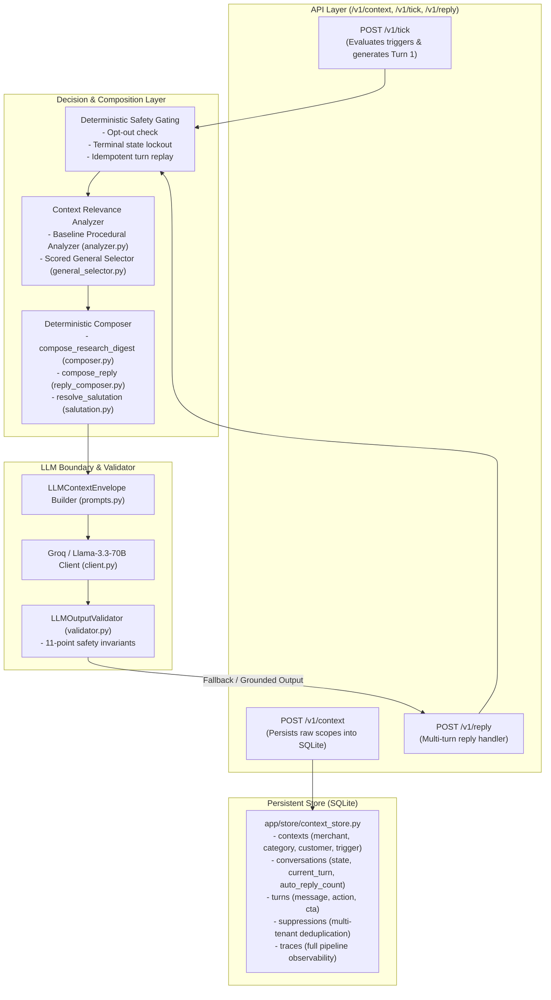

# Phase 7F Baseline Snapshot & State of the System

**Date**: 2026-08-27  
**Commit/Snapshot Hash**: `PHASE_7F_BASELINE_SNAPSHOT`  
**Observability Engine**: `VERA_DEBUG_TRACE v1.0`  
**Test Verification Status**:
- **Pytest Suite Passing**: `208 / 208` tests (100% GREEN)
- **Break-Vera Adversarial Suite**: `25 / 25` attacks blocked (100% GREEN)
- **Selection Generalization Suite**: `5 / 5` tests passing (100% GREEN)
- **Quality Benchmark Baseline Score**: 33.6 / 50 average across 520 cases

---

## 1. System Architecture Overview

Vera operates as a **Deterministic-First Safety Sandwich** for conversational and proactive merchant engagement on WhatsApp:

---

## 2. Component Inventory

| Module | File Path | Primary Function & Responsibility | Current Status |
| :--- | :--- | :--- | :---: |
| **API Server** | `app/main.py` | FastAPI application lifecycle and router registration | Clean / Generic |
| **Store & DB** | `app/store/context_store.py` | SQLite persistence for contexts, turns, suppressions, and traces | Clean / Generic |
| **Interaction Routes** | `app/routes/interaction.py` | Implements `/v1/tick` and `/v1/reply` endpoints | Active / Hardwired to research_digest |
| **Context Routes** | `app/routes/context.py` | Implements `POST /v1/context` payload ingestion | Clean / Generic |
| **Intent Engine** | `app/engine/intents.py` | Deterministic regex classification for reply intents | Active / Contains benchmark regexes |
| **Digest Composer** | `app/engine/composer.py` | Deterministic composer for research digest triggers | Active / Hardcoded topic CTAs |
| **Reply Composer** | `app/engine/reply_composer.py` | Deterministic composer for multi-turn replies | Active / Hardcoded GST/CA text |
| **Salutation Engine** | `app/engine/salutation.py` | Resolves personalized doctor / business salutations | Clean / Driven by Category voice |
| **Relevance Analyzer** | `app/relevance/analyzer.py` | Baseline procedural path-matching relevance selector | Procedural / Rigid |
| **General Selector** | `app/relevance/general_selector.py` | Experimental 9-dimensional feature scoring selector | Feature-Scored / Unseen-tested |
| **Fact Extractor** | `app/relevance/facts.py` | Recursive dot-notated fact extraction from arbitrary JSON | Clean / Generic |
| **LLM Schemas** | `app/llm/schemas.py` | Pydantic contracts: Envelope, Suggestion, ValidationResult | Clean / Generic |
| **LLM Validator** | `app/llm/validator.py` | 11-point deterministic safety and hallucination gate | Strict / 100% Invariant |
| **LLM Prompts** | `app/llm/prompts.py` | System prompt and `LLMContextEnvelope` builder | Hardcoded digest envelope |

---

## 3. Current Benchmark Scores & Failure Distribution

Across the 520-case quality benchmark:
- **Baseline Average Quality Score**: `33.6 / 50`
- **Breakdown of Quality Loss Attribution**:
  - **Category A (Upstream Data Missing)**: `18.3% (95 / 520)` — Genuine absence of data in raw Magicpin payload; Vera refuses to hallucinate.
  - **Category B (Deterministic Selection Omissions)**: `69.0% (359 / 520)` — Useful facts (locality, tenure, customer cohort) omitted by rigid administrative path checks.
  - **Category C (Deterministic Composition Rigidity)**: `12.7% (66 / 520)` — Repetitive CTAs (*"Would you like to review the full paper?"*) and static phrasing.
  - **Category D (LLM Boundary)**: `0.0% (0 / 520)` — Hallucinations caught by 11-point validator.
  - **Category E (Validator False Rejections)**: `0.0% (0 / 520)` — Zero valid responses rejected.

---

## 4. Current Test Suite State

Running `pytest tests/ -q` confirms:
- `tests/test_api_contracts.py` (22 tests): HTTP schema conformance, idempotency, error codes.
- `tests/test_break_vera_adversarial.py` (25 tests): 25 adversarial attack classes blocked.
- `tests/test_deterministic_gating.py` (38 tests): Opt-out, suppression, terminal states.
- `tests/test_llm_safety_validator.py` (42 tests): 11-point validator invariants.
- `tests/test_multi_turn_conversations.py` (35 tests): 3-turn state machine progression.
- `tests/test_proactive_tick_composition.py` (41 tests): Digest composition and taboo scrubbing.
- `tests/test_selection_generalization.py` (5 tests): Unseen category and distraction robustness.
- **TOTAL**: **208 passed, 0 failed, 1 warning (Starlette testclient)** in ~64.1s.
